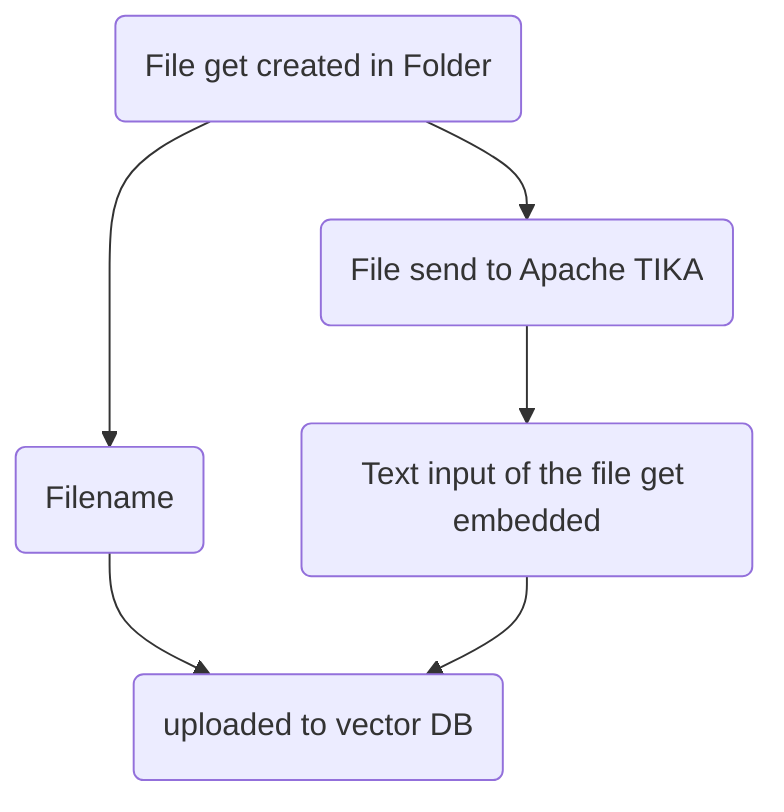

# upload_filechecker
this small part of the pipeline is very important.

Diagram of Dataflow

```mermaid
graph TB;
    id1(File get created in Folder)-->id2(File send to Apache TIKA)
    id1-->id5(Filename)-->id4
    id2-->id3(Text input of the file get embedded)
    id3-->id4(uploaded to vector DB)
```